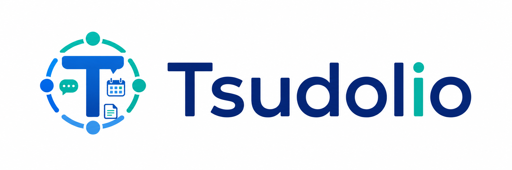

# Tsudolio（ツドリオ）



自治体、病院、民間企業で共通利用できることを目指す、公開前提のグループウェア基盤です。最初は Web/PWA として実装し、スマートフォンとデスクトップの両方で使える業務画面から育てます。

## Goals

- Web/PWA first: スマホ、タブレット、PC で同一コードベースを利用する
- Public by default: GitHub 公開を前提に、秘密情報をリポジトリに含めない
- Multi-tenant ready: SaaS、庁内/院内単独環境、閉域網展開に耐える構成にする
- Security first: 監査ログ、権限管理、MFA/SSO、バックアップを初期設計に含める
- Modular domains: 自治体、医療、民間向けの差分は後付けモジュールに分ける

## MVP Scope

- 認証、SSO、MFA の受け皿
- 組織、部署、役職、権限管理
- スケジュール、施設予約
- 掲示板、回覧、通知
- 申請、承認ワークフロー
- ファイル管理
- 監査ログ
- 管理者向けテナント設定

## Tech Stack

- Monorepo: npm workspaces
- Web: Next.js, TypeScript, React
- UI: CSS Modules/global CSS, lucide-react
- Database: PostgreSQL
- Object storage: S3 compatible storage, MinIO for local development
- Future API: Fastify or NestJS with OpenAPI
- Future auth: OIDC/SAML via Keycloak or managed IdP

## Quick Start

```bash
npm install
npm run dev
```

Open `http://localhost:3000`.

Local infrastructure can be started with:

```bash
docker compose up -d
```

Password reset emails are captured by Mailpit at `http://localhost:8025` in
local development.

To initialize the local PostgreSQL schema and seed a working tenant:

```bash
cp .env.example .env
npm --workspace apps/web run db:migrate
npm --workspace apps/web run db:seed
```

Useful API checks after seeding:

```bash
curl http://localhost:3000/api/health
curl http://localhost:3000/api/dashboard
```

## Repository Layout

```text
apps/web/              Next.js PWA package
apps/web/src/app/      App Router routes, layouts, and API route handlers
apps/web/src/          web source layers: domain, application, infrastructure, presentation
apps/web/prisma/       PostgreSQL schema, migrations, and seed data
docs/                  architecture, security, roadmap, data model
.github/               CI and dependency automation
docker-compose.yml     local PostgreSQL, MinIO, and Mailpit
```

## Current Status

This repository now includes the core groupware workflows, document registry, audit trail, the first operations console, operations backup import validation, and an operations security hardening checklist. PostgreSQL/Prisma back the local tenant, organization, workflow, document, security, and operations APIs.
